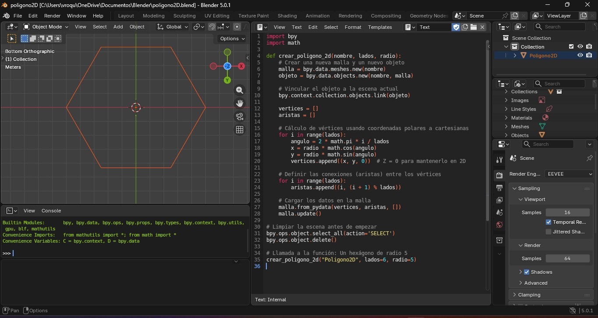

# PRACTICA - Polígono 2D en Blender con Python

## Introducción

En esta práctica se desarrolla un script en Python utilizando la API `bpy` de Blender para generar un polígono regular en el plano XY.  
El objetivo es comprender cómo se pueden crear figuras geométricas de manera programada mediante cálculos matemáticos y estructuras de control.

El polígono generado en este caso es un hexágono (6 lados), pero el código permite modificar el número de lados para crear cualquier polígono regular.

---

## Código en Python

```python
import bpy
import math

def crear_poligono_2d(nombre, lados, radio):
    # Crear una nueva malla y un nuevo objeto
    malla = bpy.data.meshes.new(nombre)
    objeto = bpy.data.objects.new(nombre, malla)

    # Vincular el objeto a la escena actual
    bpy.context.collection.objects.link(objeto)

    vertices = []
    aristas = []

    # Cálculo de vértices usando coordenadas polares a cartesianas
    for i in range(lados):
        angulo = 2 * math.pi * i / lados
        x = radio * math.cos(angulo)
        y = radio * math.sin(angulo)
        vertices.append((x, y, 0))  # Z = 0 para mantenerlo en 2D

    # Definir las conexiones (aristas) entre los vértices
    for i in range(lados):
        aristas.append((i, (i + 1) % lados))

    # Cargar los datos en la malla
    malla.from_pydata(vertices, aristas, [])
    malla.update()

# Limpiar la escena antes de empezar
bpy.ops.object.select_all(action='SELECT')
bpy.ops.object.delete()

# Llamada a la función: Un hexágono de radio 5
crear_poligono_2d("Poligono2D", lados=6, radio=5)
```

---

## Explicación detallada del código

### 1. Importación de librerías

Se importa:

- `bpy`: Permite interactuar con Blender desde Python.
- `math`: Se utiliza para realizar cálculos matemáticos como seno, coseno y el valor de π.

---

### 2. Creación de la función

Se define la función:

```python
crear_poligono_2d(nombre, lados, radio)
```

Esta función recibe:
- `nombre`: Nombre del objeto en Blender.
- `lados`: Cantidad de lados del polígono.
- `radio`: Distancia desde el centro hasta cada vértice.

Esto permite que el código sea reutilizable y flexible.

---

### 3. Creación de la malla y el objeto

Se crea una nueva malla y luego un objeto que la contiene.  
Después se vincula el objeto a la colección actual para que aparezca en la escena.

---

### 4. Cálculo de los vértices

Se utiliza un ciclo `for` que se repite según el número de lados.

Para cada vértice se calcula un ángulo:

angulo = 2πi / lados

Luego se convierten coordenadas polares a cartesianas usando:

x = r cos(θ)  
y = r sen(θ)

Donde:
- r es el radio
- θ es el ángulo
- Z se mantiene en 0 para que sea una figura 2D

Esto permite distribuir los puntos uniformemente alrededor del centro.

---

### 5. Creación de las aristas

Se conecta cada vértice con el siguiente utilizando:

(i, (i + 1) % lados)

El operador módulo (%) permite que el último vértice se conecte nuevamente con el primero, cerrando la figura.

---

### 6. Carga de datos en la malla

Se utiliza:

malla.from_pydata(vertices, aristas, [])

Para enviar los vértices y las conexiones a Blender y generar la geometría.

---

### 7. Limpieza de la escena

Antes de crear el nuevo polígono, se eliminan los objetos existentes para evitar superposiciones.

---

## Resultado en Blender



---

## Explicación

Se utilizan las fórmulas matemáticas:

x = r cos(θ)  
y = r sen(θ)

Donde:
- r es el radio
- θ es el ángulo que se calcula dividiendo 360° entre el número de lados

Esto permite distribuir los vértices uniformemente formando un hexágono regular.

## Conclusión

Mediante el uso de programación y fórmulas trigonométricas es posible generar figuras geométricas de manera precisa y automática en Blender.  
Este ejercicio demuestra cómo la matemática y la programación se combinan para crear modelos 3D de forma eficiente.
